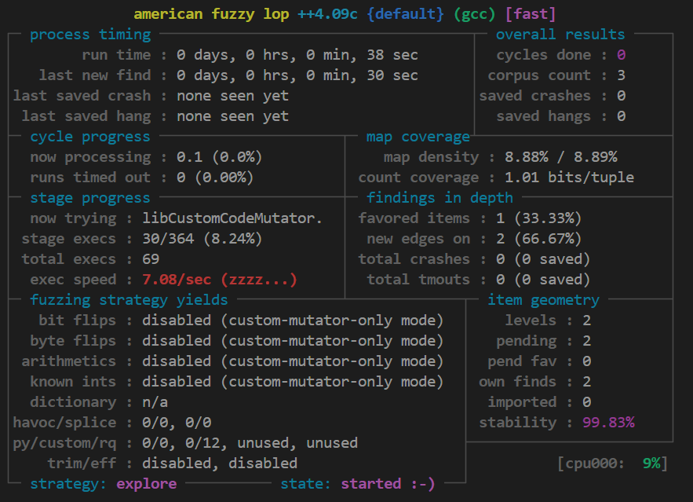
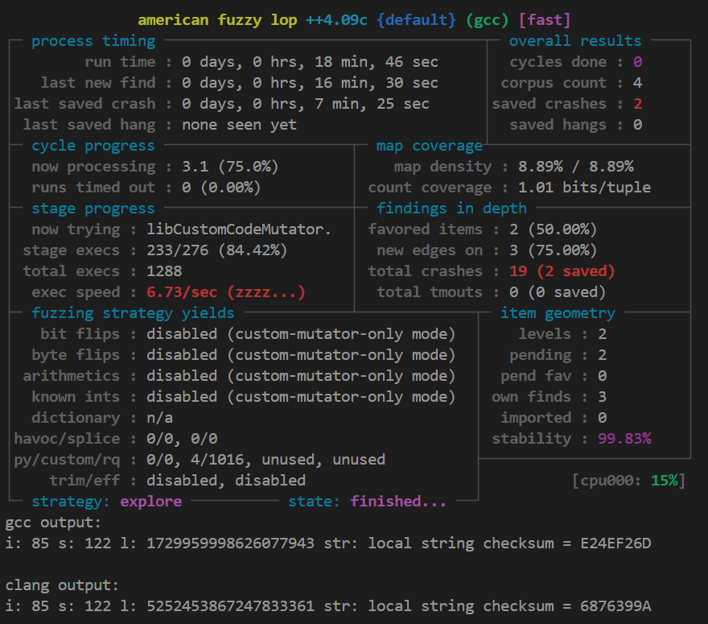

# fuzzCompilers

This is our project for Software Verification course

**How to run our tool**
1. In `fuzz_compilers.sh`, change the compilers to be tested (`TARGET_COMPILER` and `SECOND_COMPILER`). By default they are `GCC` and `Clang`.

2. Run `fuzz_compilers.sh`.
```
./fuzz_compilers.sh
```

This will start fuzzing the target compiler and compare its output with the second compiler.




After fuzzing for some time, the divergent message will be printed out
